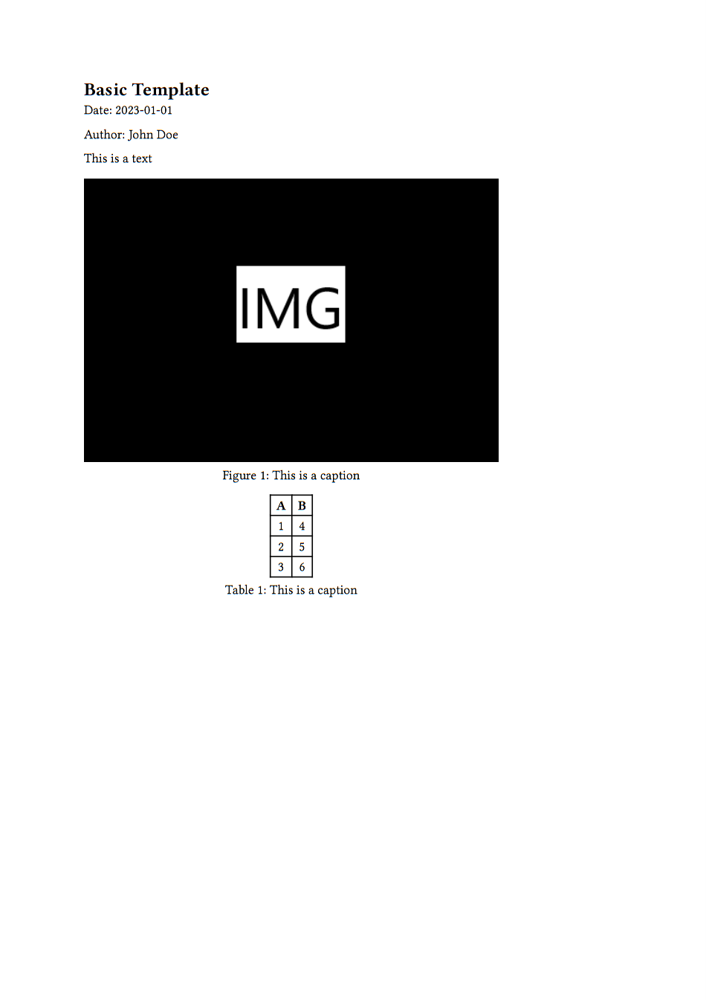

# typy

typy is a Python library to generate reports, presentations, and other documents (for now, only PDFs) using Typst. The library offers an easy-to-use API to create documents from predefined templates, templates that you can create, or from scratch.

> [!WARNING]
> This library is still very experimental and for now my main goal is to test the idea as a whole.

typy is composed of two main components:
* the Python library, which is the interface to create documents
* the Typst library, which acts as glue code between the Python library and the Typst markup language.

## Installation

To install typy, you can use pip:

```bash
pip install git+https://github.com/mgoulao/typy
```

## Basic usage

The following code snippet shows how to create a simple PDF document using typy:

```python
from pathlib import Path

import pandas as pd

from typy.builder import (
    DocumentBuilder,
)
from typy.content import Content
from typy.functions import Block, Figure, Image, Table
from typy.markup import Text
from typy.templates import BasicTemplate

builder = DocumentBuilder()
# Files must be explicitly added to the document builder
img_path = builder.add_file(Path(__file__).parent / "example.png")

table_df = pd.DataFrame({"A": [1, 2, 3], "B": [4, 5, 6]})

# Build like you would using Typst
body = Block(
    Content(
        [
            Text("This is a text"),
            Figure(Image(img_path), caption="This is a caption"),
            Figure(Table(table_df.to_dict()), caption="This is a caption"),
        ]
    )
)

template = BasicTemplate(
    title="Basic Template",
    date="2023-01-01",
    author="John Doe",
    body=body,
)

builder.add_template(template).save_pdf("basic.pdf")
```

### Result




## Templates

### Typst

Templates in Typst must:
* import the `typy` Typst library which exposes the `init_typy` function, which initializes the data for the placeholder functions
* import the `typy_data.typ` file, which will be created by the Python library during build time and which will contain the data to be used in the template
* initialize typy using the `init_typy` function

```typst
#import "@preview/diatypst:0.4.0": *
#import "typy.typ": init_typy
#import "typy_data.typ": typy_data

#let typy = init_typy(typy_data)

#show: slides.with(
  title: typy("title", "str"), // Required
  subtitle: "easy slides in typst",
  date: typy("date", "str"),
  authors: (typy("author", "str")),
  // Optional Styling (for more / explanation see in the typst universe)
  ratio: 16/9,
  layout: "medium",
  title-color: blue.darken(60%),
  toc: true,
)

= First Section

#typy("content1", "content")

== First Slide

#lorem(20)

/ *Term*: Definition
```

### Python

To declare a template in Python, you must:
1. Create a class that inherits from the `Template`
2. Define the default fields of the template (i.e. `__template_name__` and `__template_path__`)
3. Define the data model of the template by adding fields to the class

```python
from typy.templates import Template


@dataclass
class CustomTemplate(Template):
    title: str
    body: Content

    __template_name__ = "custom"
    __template_path__ = Path(__file__).parent / "custom.typ"
```


## Typst encoding

The current code to encode the data into Typst markup is still very basic and only supports a few types, functions, and markup elements. **Most importantly, it is very buggy.**
