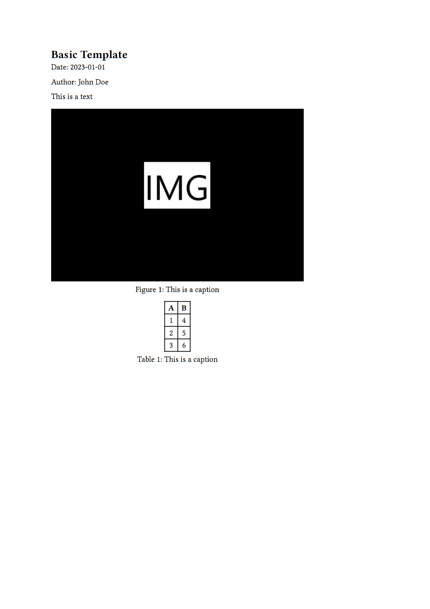

# typy

typy is a Python library for generating polished PDFs with Typst.
It provides:

- a typed Python API
- a CLI for quick rendering workflows
- reusable built-in templates (report, invoice, letter, CV, presentation, and more)

> [!WARNING]
> typy is still experimental and APIs may change between releases.



## Install

```bash
pip install git+https://github.com/mgoulao/typy
```

## Quick start (CLI)

```bash
typy scaffold report --output data.json
typy render --template report --data data.json --output report.pdf
```

## Quick start (Python)

```python
from typy.builder import DocumentBuilder
from typy.templates import BasicTemplate

template = BasicTemplate(
    title="Hello typy",
    date="2026-04-24",
    author="Your Name",
    body="## Welcome\n\nThis PDF was generated from Python.",
)

DocumentBuilder().add_template(template).save_pdf("hello-typy.pdf")
```

## Template gallery

| Template | Description |
|---|---|
| **report** | Multi-section report with optional TOC, abstract, and running headers |
| **invoice** | Business invoice with line-item table and totals |
| **letter** | Formal business letter with letterhead |
| **cv** | CV / résumé with experience, education, and skills |
| **academic** | Academic paper with abstract, two-column mode, and bibliography |
| **presentation** | 16:9 slide deck with hero, two-column, and blank layout variants |
| **basic** | Minimal single-section document |

Generate preview images for all templates by running:

```bash
python scripts/generate_previews.py
```

## Documentation

Published documentation website: [mgoulao.github.io/typy](https://mgoulao.github.io/typy/)

Source docs in this repository:

- [Getting started](https://mgoulao.github.io/typy/getting-started.html)
- [Cookbook](https://mgoulao.github.io/typy/cookbook.html)
- [Template reference](https://mgoulao.github.io/typy/templates.html)
- [CLI reference](https://mgoulao.github.io/typy/cli.html)
- [API reference](https://mgoulao.github.io/typy/api.html)
- [Package format](https://mgoulao.github.io/typy/package-format.html)
- [LLM-oriented docs](https://mgoulao.github.io/typy/llm.html)

## Examples

Runnable examples are in [examples/](examples/):

- [basic](examples/basic/basic.py)
- [report](examples/report/report.py)
- [invoice](examples/invoice/invoice.py)
- [letter](examples/letter/letter.py)
- [presentation](examples/presentation/presentation.py)
- [academic](examples/academic/academic.py)
- [cv](examples/cv/cv.py)

## Contributing and development

Contributor workflows (tests, linting, docs build, and release practices) are documented in [DEVELOPMENT.md](DEVELOPMENT.md).
