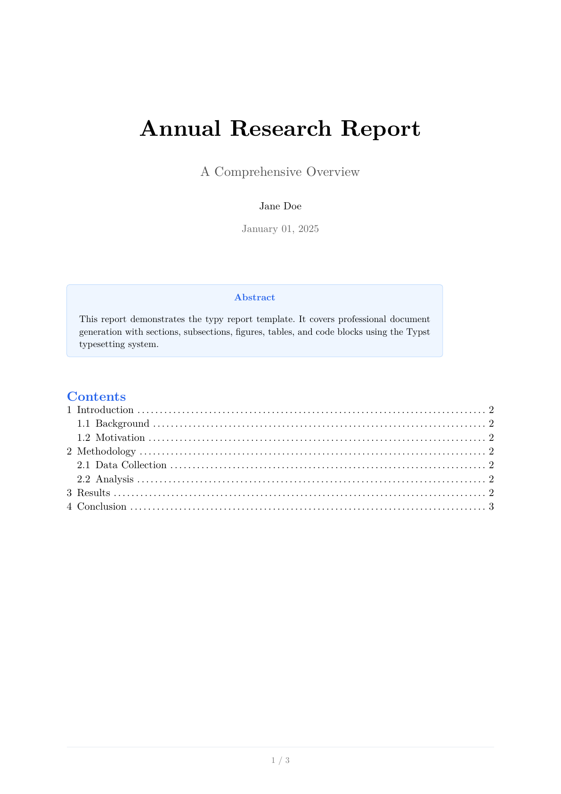
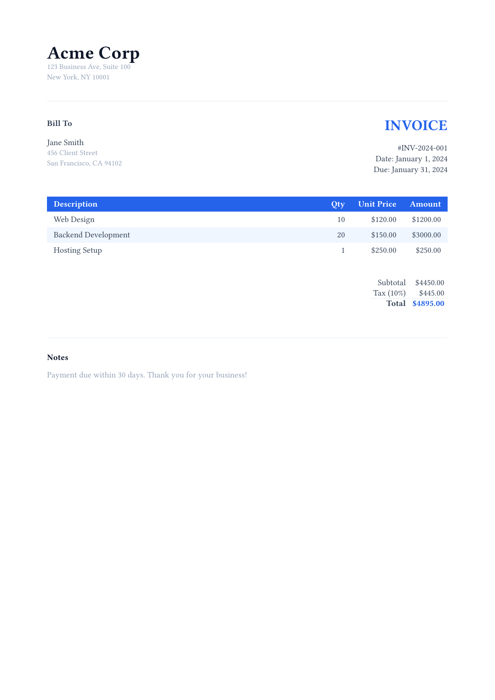
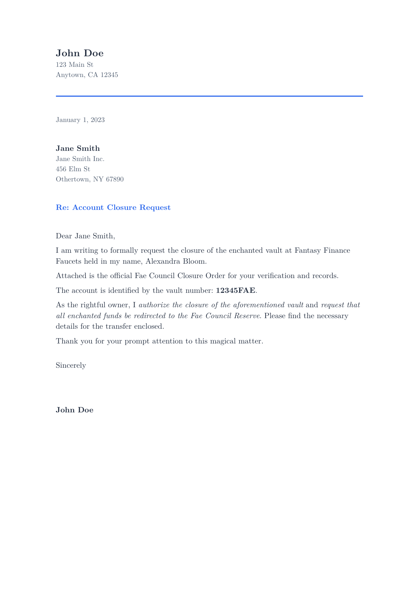
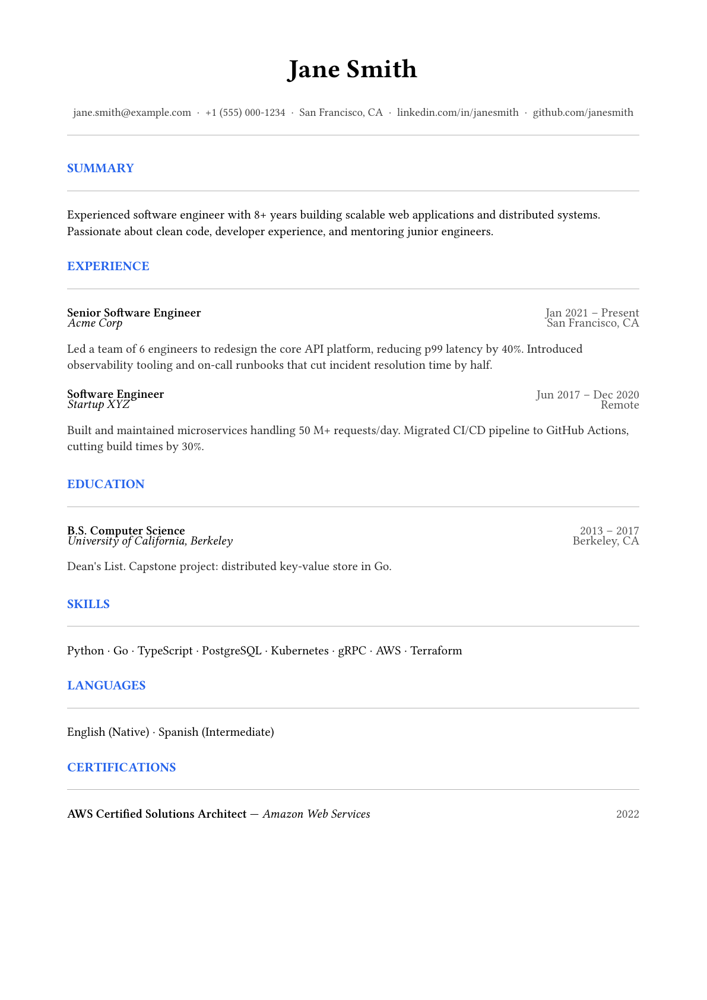
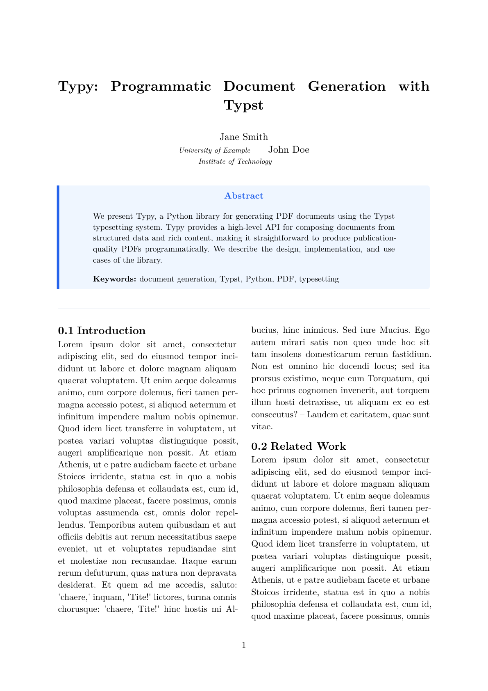
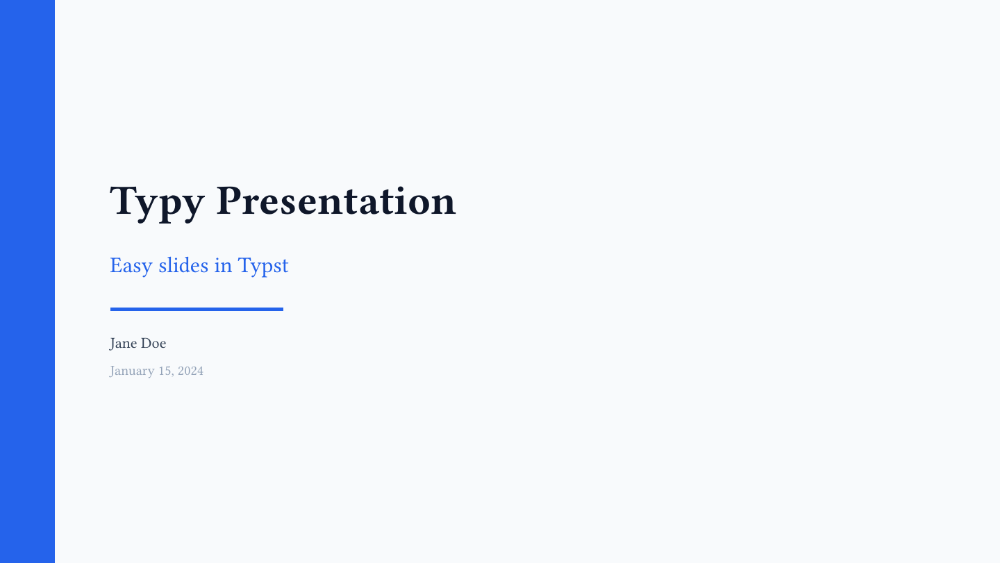
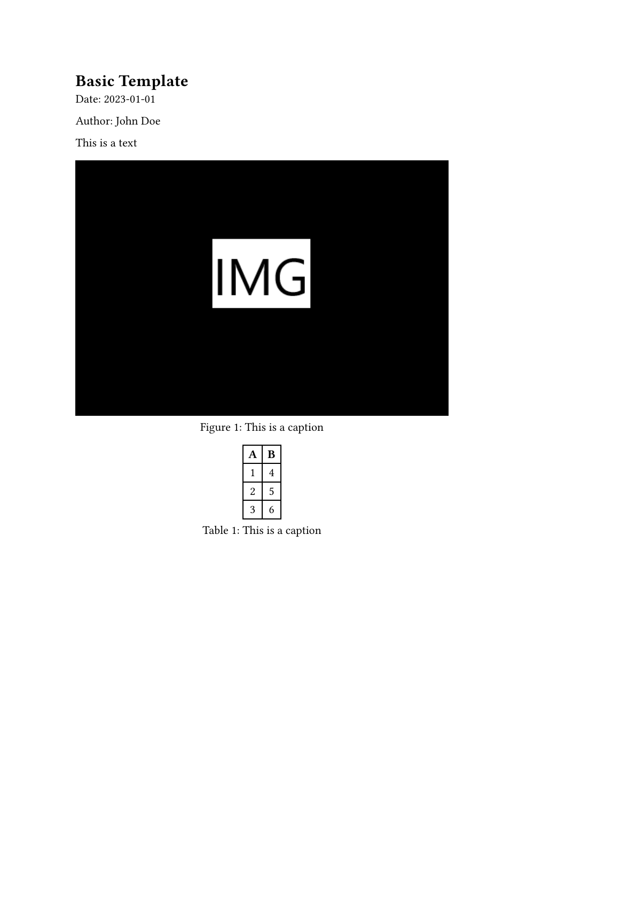
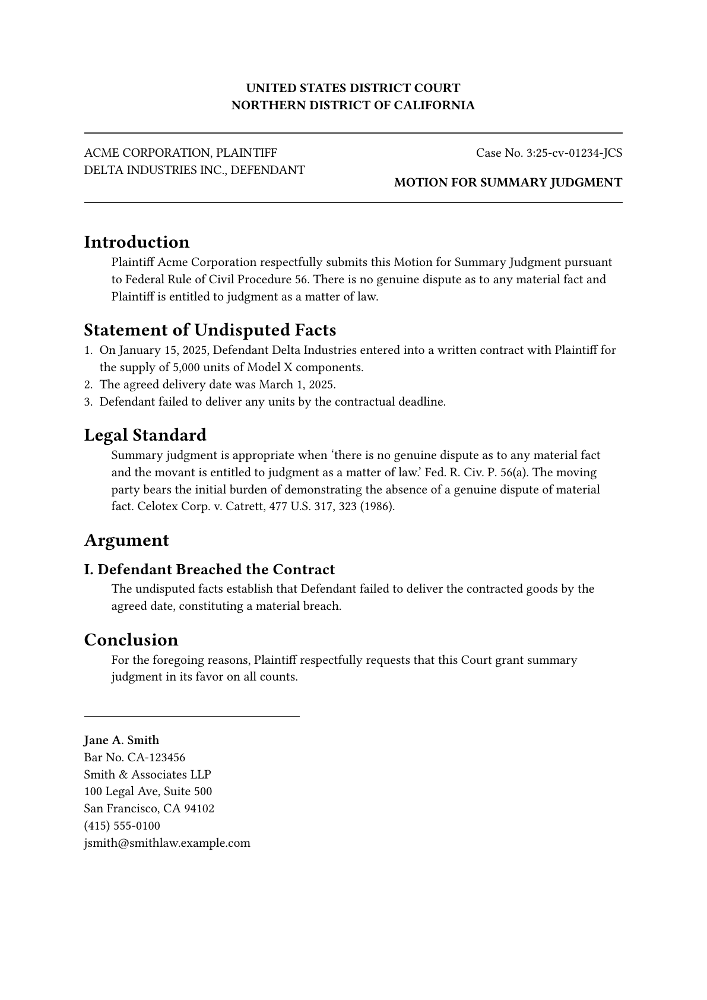
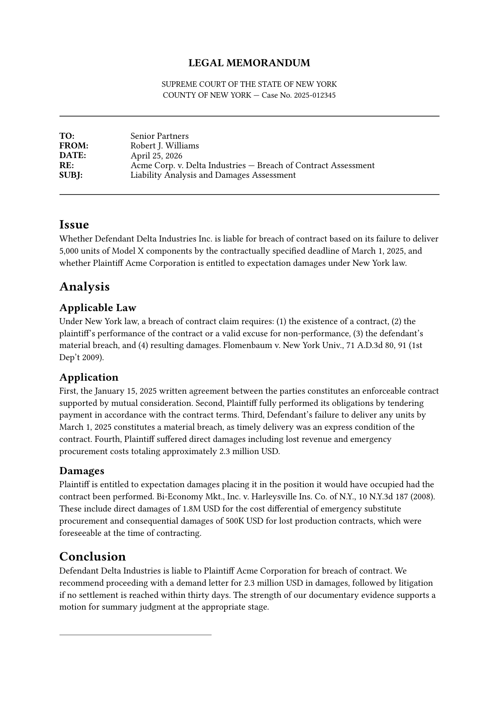

# Template reference

typy ships nine built-in templates grouped into two categories:

- **General-purpose** (seven templates): a consistent blue-600 / slate palette shared across standalone templates.
- **Legal vertical** (two templates): part of the `legal` design system — court filings and memos with case captions, line numbering, and signature blocks. See [Vertical design systems](design-systems.md) for the architecture.

## Templates at a glance

| report | invoice | letter |
|---|---|---|
| [](#report) | [](#invoice) | [](#letter) |
| **cv** | **academic** | **presentation** |
| [](#cv) | [](#academic) | [](#presentation) |
| **basic** | | |
| [](#basic) | | |

**Legal vertical**

| legal-brief | legal-memo |
|---|---|
| [](#legal-brief) | [](#legal-memo) |

| Template | Best for | Key fields |
|---|---|---|
| [`report`](#report) | Multi-section reports with TOC | `title`, `author`, `body`, `abstract`, `toc` |
| [`invoice`](#invoice) | Business invoices with line items | `company_name`, `client_name`, `items`, `tax_rate` |
| [`letter`](#letter) | Formal letters with letterhead | `sender_name`, `recipient_name`, `subject`, `body` |
| [`cv`](#cv) | CV / résumé | `name`, `contact`, `experience`, `education`, `skills` |
| [`academic`](#academic) | Academic papers with bibliography | `title`, `authors`, `abstract`, `body`, `two_column` |
| [`presentation`](#presentation) | 16:9 slide decks | `title`, `author`, `slides` (each with `layout_variant`) |
| [`basic`](#basic) | Minimal single-section documents | `title`, `author`, `body` |
| [`legal-brief`](#legal-brief) *(legal vertical)* | Court filings with caption & line numbers | `court`, `case_number`, `parties`, `document_title`, `body` |
| [`legal-memo`](#legal-memo) *(legal vertical)* | Internal legal memos (IRAC) | `court`, `case_number`, `parties`, `to`, `from_`, `issue`, `analysis`, `conclusion` |

Use `typy info <template>` to inspect fields in table form.

Use `typy info <template> --json` for machine-readable schema output.

## report

A multi-page report with optional abstract, table of contents, running header, and page numbers.

**Key fields**: `title`, `subtitle`, `author`, `date`, `body`, `abstract`, `toc`

```python
from typy.builder import DocumentBuilder
from typy.content import Content
from typy.markup import Heading
from typy.templates import ReportTemplate

body = Content([
    Heading(1, "Introduction"),
    "This report was generated with **typy**.",
    Heading(1, "Conclusion"),
    "Summary of findings goes here.",
])

template = ReportTemplate(
    title="Quarterly Report",
    subtitle="Q1 2026",
    author="Jane Doe",
    date="April 2026",
    body=body,
    abstract=Content(["A brief summary of the report."]),
    toc=True,
)

DocumentBuilder().add_template(template).save_pdf("report.pdf")
```

See the full runnable example at [`examples/report/report.py`](../examples/report/report.py).

## invoice

A one-page business invoice with a line-item table, subtotal/tax/total block, and optional notes.

**Key fields**: `company_name`, `company_address`, `client_name`, `client_address`,
`invoice_number`, `date`, `due_date`, `items` (list of `description`/`quantity`/`unit_price`),
`tax_rate`, `notes`, `logo`

```python
from typy.builder import DocumentBuilder
from typy.templates import InvoiceItem, InvoiceTemplate

template = InvoiceTemplate(
    company_name="Acme Corp",
    company_address="123 Business Ave\nNew York, NY 10001",
    client_name="Jane Smith",
    client_address="456 Client St\nSan Francisco, CA 94102",
    invoice_number="INV-2026-001",
    date="April 25, 2026",
    due_date="May 25, 2026",
    items=[
        InvoiceItem(description="Web Design", quantity=10, unit_price=120.0),
        InvoiceItem(description="Backend Development", quantity=20, unit_price=150.0),
    ],
    tax_rate=10.0,
    notes="Payment due within 30 days.",
)

DocumentBuilder().add_template(template).save_pdf("invoice.pdf")
```

See the full runnable example at [`examples/invoice/invoice.py`](../examples/invoice/invoice.py).

## letter

A formal business letter with optional letterhead logo.

**Key fields**: `sender_name`, `sender_address`, `recipient_name`, `recipient_address`,
`date`, `subject`, `body`, `closing`, `signature_name`, `logo`

```python
from typy.builder import DocumentBuilder
from typy.content import Content
from typy.templates import LetterTemplate

template = LetterTemplate(
    sender_name="John Doe",
    sender_address="123 Main St\nAnytown, CA 12345",
    recipient_name="Jane Smith",
    recipient_address="Jane Smith Inc.\n456 Elm St\nOthertown, NY 67890",
    date="April 25, 2026",
    subject="Project Proposal",
    body=Content(["I am writing to propose a new project collaboration."]),
    closing="Sincerely",
    signature_name="John Doe",
)

DocumentBuilder().add_template(template).save_pdf("letter.pdf")
```

See the full runnable example at [`examples/letter/letter.py`](../examples/letter/letter.py).

## cv

A single-page CV / résumé with experience, education, skills, languages, and certifications.

**Key fields**: `name`, `contact` (email/phone/location/links), `summary`, `experience`,
`education`, `skills`, `languages`, `certifications`

```python
from typy.builder import DocumentBuilder
from typy.templates import CVContact, CVEducation, CVExperience, CVTemplate

template = CVTemplate(
    name="Jane Smith",
    contact=CVContact(
        email="jane@example.com",
        phone="+1 555 000 1234",
        location="San Francisco, CA",
        links=["github.com/janesmith"],
    ),
    summary="Software engineer with 8+ years of experience building scalable systems.",
    experience=[
        CVExperience(
            title="Senior Software Engineer",
            company="Acme Corp",
            start_date="Jan 2021",
            end_date="Present",
            location="San Francisco, CA",
            description="Led API platform redesign, reducing p99 latency by 40%.",
        ),
    ],
    education=[
        CVEducation(
            degree="B.S. Computer Science",
            institution="UC Berkeley",
            start_date="2013",
            end_date="2017",
        ),
    ],
    skills=["Python", "Go", "TypeScript", "PostgreSQL", "Kubernetes"],
)

DocumentBuilder().add_template(template).save_pdf("cv.pdf")
```

See the full runnable example at [`examples/cv/cv.py`](../examples/cv/cv.py).

## academic

An academic paper template with abstract box, optional two-column body, and bibliography support.

**Key fields**: `title`, `authors` (list of `name`/`affiliation`), `abstract`, `keywords`,
`body`, `two_column`, `bibliography_path`

```python
from typy.builder import DocumentBuilder
from typy.content import Content
from typy.markup import Heading
from typy.templates import AcademicAuthor, AcademicTemplate

body = Content([
    Heading(2, "Introduction"),
    "We present a new approach to document generation.",
    Heading(2, "Conclusion"),
    "Our results demonstrate the effectiveness of the approach.",
])

template = AcademicTemplate(
    title="Programmatic PDF Generation with Typst",
    authors=[
        AcademicAuthor(name="Jane Smith", affiliation="University of Example"),
        AcademicAuthor(name="John Doe", affiliation="Institute of Technology"),
    ],
    abstract="We present typy, a Python library for generating PDFs with Typst.",
    keywords=["PDF", "Typst", "Python"],
    body=body,
    two_column=True,
)

DocumentBuilder().add_template(template).save_pdf("paper.pdf")
```

See the full runnable example at [`examples/academic/academic.py`](../examples/academic/academic.py).

## presentation

A 16:9 slide deck with an auto-generated title slide and per-slide layout variants.

**Key fields**: `title`, `subtitle`, `author`, `date`, `slides`, `theme`

```python
from typy.builder import DocumentBuilder
from typy.content import Content
from typy.templates import PresentationTemplate, Slide

template = PresentationTemplate(
    title="Typy Presentation",
    subtitle="Easy slides in Typst",
    author="Jane Doe",
    date="April 2026",
    slides=[
        Slide(
            title="Introduction",
            body=Content(["Welcome to **typy** — slides built from Python."]),
        ),
        Slide(
            title="Section Break",
            body=Content(["Key insight goes here."]),
            layout_variant="hero",
        ),
        Slide(
            title="Comparison",
            body=Content(["Before #colbreak() After"]),
            layout_variant="two-column",
        ),
        Slide(
            title="Conclusion",
            body=Content(["Thank you! Find typy at *github.com/mgoulao/typy*"]),
            layout_variant="hero",
        ),
    ],
)

DocumentBuilder().add_template(template).save_pdf("deck.pdf")
```

See the full runnable example at [`examples/presentation/presentation.py`](../examples/presentation/presentation.py).

### Slide layout variants

Each `Slide` accepts a `layout_variant` field that controls the page layout:

| `layout_variant` | Description |
|---|---|
| `None` / `"default"` | Accent header bar at the top, body below |
| `"hero"` | Full accent background, large centred title and body |
| `"two-column"` | Accent header, body split into two equal columns |
| `"blank"` | No header, body fills the whole slide |

## basic

A minimal document for quick notes and one-off outputs.

**Key fields**: `title`, `author`, `date`, `body`

```python
from typy.builder import DocumentBuilder
from typy.templates import BasicTemplate

template = BasicTemplate(
    title="Hello typy",
    date="April 25, 2026",
    author="Your Name",
    body="## Welcome\n\nThis PDF was generated from Python.",
)

DocumentBuilder().add_template(template).save_pdf("hello.pdf")
```

See the full runnable example at [`examples/basic/basic.py`](../examples/basic/basic.py).

## legal-brief

*(Legal vertical)* A court filing brief with a structured case caption, optional paragraph-level line numbering, an attorney signature block, and an optional certificate of service. Part of the `legal` design system — see [Vertical design systems](design-systems.md).

**Shared fields** (from `LegalBase`): `court`, `case_number`, `jurisdiction`, `parties`, `attorney_info`

**Brief-specific fields**: `document_title`, `body`, `line_numbering`, `certificate_of_service`

```python
from typy.builder import DocumentBuilder
from typy.content import Content
from typy.markup import Heading
from typy.templates import (
    LegalAttorneyInfo,
    LegalBriefTemplate,
    LegalLineNumbering,
    LegalParty,
)

template = LegalBriefTemplate(
    court="UNITED STATES DISTRICT COURT\nNORTHERN DISTRICT OF CALIFORNIA",
    case_number="3:25-cv-01234-JCS",
    jurisdiction="Federal",
    parties=[
        LegalParty(name="ACME CORPORATION", role="Plaintiff"),
        LegalParty(name="DELTA INDUSTRIES INC.", role="Defendant"),
    ],
    attorney_info=LegalAttorneyInfo(
        name="Jane A. Smith",
        bar_number="CA-123456",
        firm="Smith & Associates LLP",
        address="100 Legal Ave, Suite 500\nSan Francisco, CA 94102",
        phone="(415) 555-0100",
        email="jsmith@smithlaw.example.com",
    ),
    document_title="MOTION FOR SUMMARY JUDGMENT",
    body=Content([
        Heading(1, "Introduction"),
        "Plaintiff respectfully submits this Motion for Summary Judgment.",
        Heading(1, "Conclusion"),
        "Plaintiff requests judgment as a matter of law.",
    ]),
    line_numbering=LegalLineNumbering(enabled=True, start=1, interval=5),
    certificate_of_service=(
        "I certify this document was served on all parties via CM/ECF."
    ),
)

DocumentBuilder().add_template(template).save_pdf("brief.pdf")
```

### LegalLineNumbering fields

| Field | Type | Default | Description |
|---|---|---|---|
| `enabled` | `bool` | `True` | Toggle line numbering on/off |
| `start` | `int` | `1` | Starting paragraph number |
| `interval` | `int` | `1` | Display a number every N paragraphs |

See the full runnable example at [`examples/legal-brief/legal_brief.py`](../examples/legal-brief/legal_brief.py).

## legal-memo

*(Legal vertical)* An internal legal memorandum using the IRAC structure (Issue / Analysis / Conclusion) with citation-friendly formatting and an attorney signature block. Part of the `legal` design system — see [Vertical design systems](design-systems.md).

**Shared fields** (from `LegalBase`): `court`, `case_number`, `jurisdiction`, `parties`, `attorney_info`

**Memo-specific fields**: `document_title`, `date`, `to`, `from_`, `re`, `issue`, `analysis`, `conclusion`

```python
from typy.builder import DocumentBuilder
from typy.content import Content
from typy.templates import (
    LegalAttorneyInfo,
    LegalMemoTemplate,
    LegalParty,
)

template = LegalMemoTemplate(
    court="SUPREME COURT OF NEW YORK\nCOUNTY OF NEW YORK",
    case_number="2025-012345",
    jurisdiction="New York State",
    parties=[
        LegalParty(name="ACME CORPORATION", role="Plaintiff"),
        LegalParty(name="DELTA INDUSTRIES INC.", role="Defendant"),
    ],
    attorney_info=LegalAttorneyInfo(
        name="Robert J. Williams",
        bar_number="NY-987654",
        firm="Williams Legal Group",
        address="250 Park Avenue\nNew York, NY 10177",
    ),
    document_title="Liability Analysis and Damages Assessment",
    date="April 25, 2026",
    to="Senior Partners",
    from_="Robert J. Williams",
    re="Acme Corp. v. Delta Industries — Breach of Contract",
    issue=Content(["Whether defendant is liable for breach of contract."]),
    analysis=Content([
        "Under New York law, a breach of contract claim requires four elements.",
    ]),
    conclusion=Content(["Defendant is liable; recommend filing suit."]),
)

DocumentBuilder().add_template(template).save_pdf("memo.pdf")
```

See the full runnable example at [`examples/legal-memo/legal_memo.py`](../examples/legal-memo/legal_memo.py).

## Inspect any template

```bash
typy info report
typy info invoice --json
typy info legal-brief --json
```
